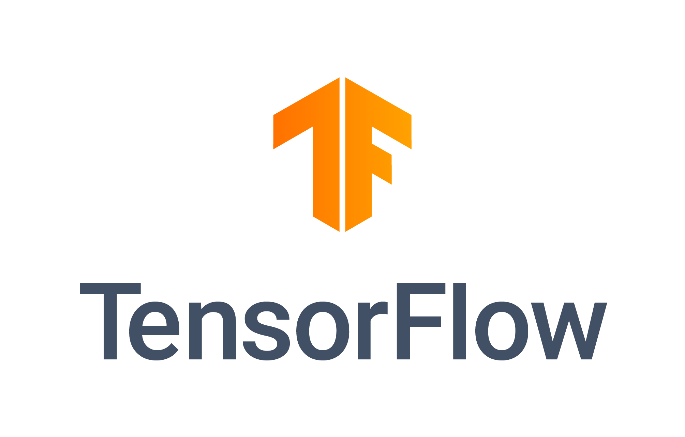

# TensorFlow labs

Notebooks and scripts to prepare the [TensorFlow Developer Certificate](https://www.tensorflow.org/certificate), as well as other samples covering more content.

> This repo contains some exercises to be completed. In some files, code may contain some `TODO` to be completed/filled. The solution is not included in this repo. 

Originally based on [this repo](https://github.com/https-deeplearning-ai/tensorflow-1-public).

 
## Exercises Block 01

* Notebook 1: [Simple DNN](01-intro/1-house-prices.ipynb)
* Notebook 2: [MNIST with simple DNN](01-intro/2-mnist-mlp.ipynb)

## Exercises Block 02

* Notebook 3: [MNIST with CNN (Convolutions)](02-cnn/3-mnist-cnn.ipynb) 
* Notebook 4: [Ccat-dogs with Data augmentation](02-cnn/4-cat-dog-imagegen.ipynb)
* Notebook 5: [Language Sign with Data augmentation](02-cnn/5-language-sign-imageplot.ipynb)
* Notebook 6: [Transfer Learning](02-cnn/6-transfer-learning.ipynb) 

## Exercises Block 03

* Notebook 7: [Tokenizer with padding example](03-rnn/7-bbc-news-tokenization.ipynb)
* Notebook 8: [Empedding notebook](03-rnn/8-embeddings.ipynb)
* Notebook 9: [Pretrained embeddings](03-rnn/9-pretrained-embeddings.ipynb)
* Notebook 10: [Text generation](03-rnn/10-sonnet-text-generation.ipynb)

## Exercises Block 04

* Notebook 11: [Windowed datasets](04-timeseries/11-naive-moving-avg-synth-data.ipynb)
* Notebook 12: [Windowed datasets with DNN](04-timeseries/12-windowed-dataset.ipynb) 
* Notebook 13: [Learning rate scheduler](04-timeseries/13-lr-scheduler.ipynb)
* Notebook 14: [Time series with CNN and LSTM](04-timeseries/14-cnn-lstm.ipynb)

## Exercises Recommendation systems

* Notebook 4: [Collaborative Filtering for Movie Recommendations in Keras 3](05-recommenders/4-cf-movielens.ipynb)
* Notebook 5: [TFRS](05-recommenders/5-tfrs.ipynb)
* Notebook 6: [RankNet](05-recommenders/6-ranknet.ipynb)